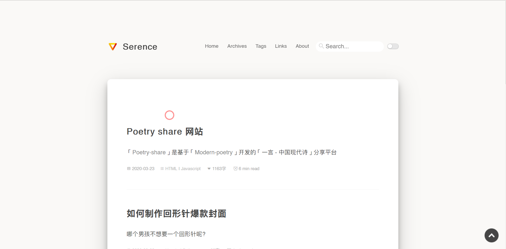
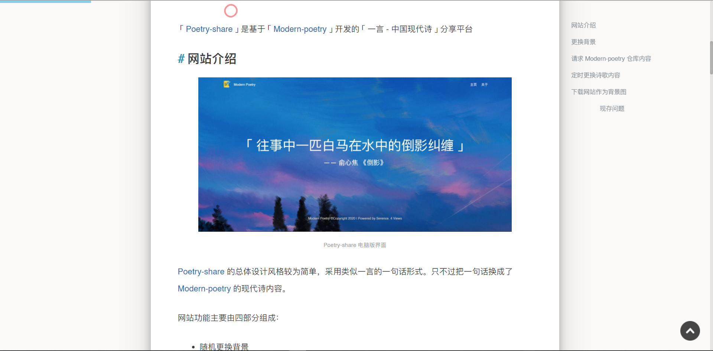
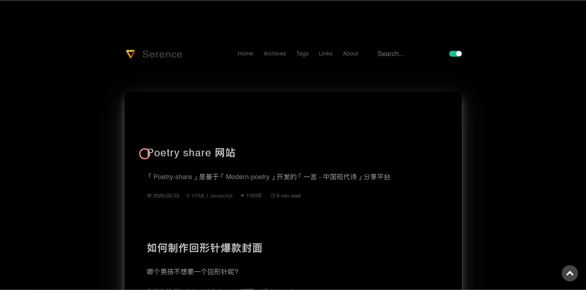

# Bitcron-pro
[My Blog](https://blog.blinkstar.cn)

Edit based on [云中君](https://shanbu.fun)'s Bitcron Theme -> [Link of Original Theme](https://github.com/alterfang/gridea-theme-bitcron)

Add these changes based on original version:
1、Add picture light box effect
2、Count reading time and word number
3、Add toc [table of contents] support
4、add dark mode
5、Add more social media icon at footer
6、Add website visits counting
7、Add support for transforming from simplified Chinese to traditional Chinese
8、Add support for Katex
9、Add article cover picture
10、Add search service(Pay attention: Using this feature, Gridea version must > 9.0)
11、Highlight code
12、Add prompt for article released for a long time
...

## Update

<b>2021.7.6</b>

<pre>
<ul>
1、Fix fuzzy search bug
2、Fix katex rendering bug
</ul>
</pre>

<b>2020.7.6</b>

<pre>
<ul>
1、Fix a bug
</ul>
</pre>

<b>2020.4.26</b>

<pre>
<ul>
1、Modularize `main.less`
</ul>
</pre>

<b>2020.4.23</b>

<pre>
<ul>
1、Fix icon display in footer
2、Add zhihu icon
</ul>
</pre>

<b>2020.4.17</b>

<pre>
<ul>
1、添加 google analytics
2、修复search.ejs中的问题
</ul>
</pre>

<b>2020.4.7</b>

<pre>
<ul>
1、Fix display problem when using Chinese as site title
</ul>
</pre>

<b>2020.4.5</b>

<pre>
<ul>
1、Fix the footer problem
</ul>
</pre>

<b>2020.3.24</b>

<pre>
<ul>
1、Upload Bitcron-pro 2.0
</ul>
</pre>

<b>Before Bitcron 2.0</b>

<pre>
<ul>
1、Fix the problem of not showing telegram icon
2、Add Spring festival feature
3、Fix the display of reward button
4、Fix the bug of opening some link in new tab
5、Add "prev posts" and "new posts" links in archives
6、Optimize the display of table of content
7、Fix bug in dark mode
8、Special feature - Christmas features(thank ant design)
9、Add toc
10、Add support for picture light box
11、Cancel Pjax function because it doesn't support some js
12、Fix pjax bug
13、Add word number support in home page
14、Replace icon in post page
15、Fix display of donate qrcode
</ul>
</pre>

## How to use

Put bitcron-pro folder in `C:/Users/$YourUserName$/Documents/Gridea/themes` [the default folder] or manually modified site source file path.

## Sponsors
\*诗
兔子翻书
Thank you for your support to this project!

## Renderings

